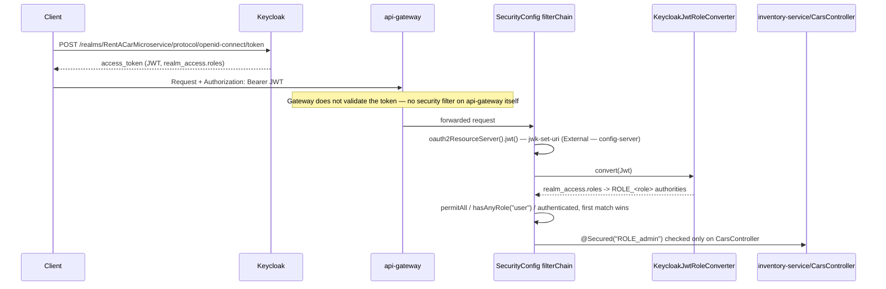
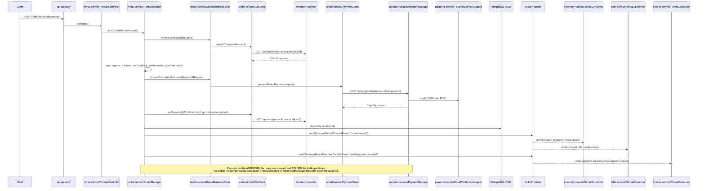
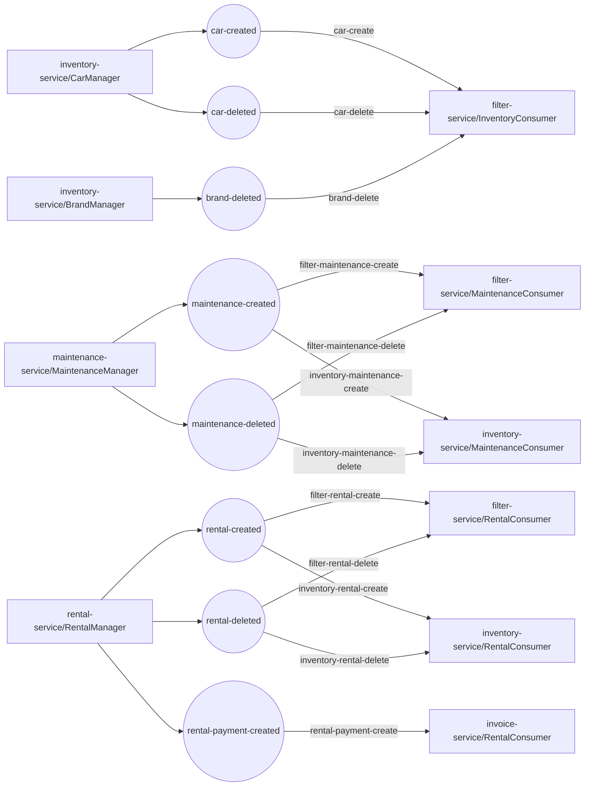

# Turkcell Rent-A-Car Microservices — Backend Audit

**Generated:** 2026-08-02

---

## 1. Executive Summary

This is a 10-module Spring Boot microservices monorepo (Java 17, Spring Boot 3.0.6/3.1.0, Spring Cloud 2022.0.2) with no root/reactor pom — six independently deployable business services (inventory, rental, maintenance, payment, invoice, filter) sit behind a Spring Cloud Gateway, register with a single Eureka instance, pull runtime config from an external git-backed config-server, authenticate via a shared Keycloak-backed `SecurityConfig` in `common-package`, and choreograph state changes over 8 Kafka topics. Persistence is polyglot and strictly database-per-service (MySQL, 3× PostgreSQL, 2× MongoDB), with no SQL migration tooling anywhere — schema comes entirely from Hibernate `ddl-auto`.

**Overall risk posture: Medium.** The core request/response and event-choreography paths are coherent and now have real unit-test coverage (38 test files, plain Mockito/`standaloneSetup`, zero live Spring context). The three highest-priority findings are: (1) the observability pipeline is silently non-functional — no `micrometer-registry-prometheus` dependency exists anywhere, so all 5 Prometheus scrape jobs are hitting endpoints that don't exist; (2) `RentalManager.add` debits a customer's payment via a synchronous Feign call *before* the local rental row is saved, with no compensating transaction if the save fails; and (3) every backing-service credential (Postgres, MySQL, Mongo, Keycloak admin) is committed in plaintext in `docker-compose.yml` with no `.env` indirection.

## 2. Service Topology

| Module | Type | Boot parent | Maven wrapper | Local port | Datastore | Uses common-package |
|---|---|---|---|---|---|---|
| `config-server` | Platform | 3.0.6 | 3.9.1 / wrapper 3.2.0 | 8888 | — | no |
| `discovery-server` | Platform | 3.0.6 | 3.8.7 / wrapper 3.1.1 | 8761 (Eureka default — <span class="badge external">Inferred</span>, not declared locally) | — | no |
| `api-gateway` | Platform | 3.0.6 | 3.8.7 / wrapper 3.1.1 | 9010 | — | no |
| `common-package` | Shared library | 3.0.6 | 3.8.7 / wrapper 3.1.1 | — | — | is |
| `inventory-service` | Business | 3.0.6 | 3.9.2 / wrapper 3.2.0 (no license header) | External | MySQL 3307 | yes |
| `rental-service` | Business | 3.0.6 | 3.8.7 / wrapper 3.1.1 | External | PostgreSQL 5434 | yes |
| `maintenance-service` | Business | **3.1.0** | 3.9.1 / wrapper 3.2.0 | External | PostgreSQL 5431 | yes |
| `payment-service` | Business | **3.1.0** | 3.8.7 / wrapper 3.1.1 | External | PostgreSQL 5433 | yes |
| `invoice-service` | Business | 3.0.6 | 3.9.1 / wrapper 3.2.0 | External | MongoDB 27018 | yes |
| `filter-service` | Business | 3.0.6 | 3.8.7 / wrapper 3.1.1 | External | MongoDB 27017 | yes |

No root `pom.xml` exists — confirmed by a repo-wide glob for `pom.xml` returning exactly 10 files, one per module directory. Every module builds independently via its own `./mvnw`; there is no reactor build.

`common-package/pom.xml`'s `spring-boot-maven-plugin` sets `<classifier>exec</classifier>` — the only module with a plugin classifier — which keeps the plain library jar under default Maven coordinates so the 6 business services can resolve it as a dependency rather than a repackaged fat jar.

Only 4 modules (`common-package`, `api-gateway`, `config-server`, `discovery-server`) declare `spring-cloud.version` and import `spring-cloud-dependencies`; the 6 business services have no `<dependencyManagement>` of their own and inherit all Spring Cloud artifacts transitively through `common-package`.

### Diagram D1 — Service Topology

```mermaid
graph LR
  Client([Client])
  subgraph Platform
    GW[api-gateway :9010]
    DISC[discovery-server :8761]
    CFG[config-server :8888]
    GIT[(github.com/altananay/config-server)]
    KC[Keycloak :8081]
  end
  subgraph "Business Services"
    INV[inventory-service]
    RENT[rental-service]
    MAINT[maintenance-service]
    PAY[payment-service]
    INVO[invoice-service]
    FILT[filter-service]
  end
  subgraph Datastores
    MYSQL[(MySQL :3307)]
    PG1[(PostgreSQL :5434)]
    PG2[(PostgreSQL :5431)]
    PG3[(PostgreSQL :5433)]
    MONGO1[(MongoDB :27018)]
    MONGO2[(MongoDB :27017)]
  end
  Client --> GW
  GW -->|/inventory-service/**| INV
  GW -->|/rental-service/**| RENT
  GW -->|/maintenance-service/**| MAINT
  GW -->|/payment-service/**| PAY
  GW -->|/invoice-service/**| INVO
  GW -->|/filter-service/**| FILT
  INV -.register.-> DISC
  RENT -.register.-> DISC
  MAINT -.register.-> DISC
  PAY -.register.-> DISC
  INVO -.register.-> DISC
  FILT -.register.-> DISC
  GW -.register.-> DISC
  INV -.spring.config.import.-> CFG
  RENT -.spring.config.import.-> CFG
  MAINT -.spring.config.import.-> CFG
  PAY -.spring.config.import.-> CFG
  INVO -.spring.config.import.-> CFG
  FILT -.spring.config.import.-> CFG
  DISC -.spring.config.import.-> CFG
  CFG --> GIT
  INV --> MYSQL
  RENT --> PG1
  MAINT --> PG2
  PAY --> PG3
  INVO --> MONGO1
  FILT --> MONGO2
  INV -.jwk-set-uri.-> KC
  RENT -.jwk-set-uri.-> KC
  MAINT -.jwk-set-uri.-> KC
  PAY -.jwk-set-uri.-> KC
  INVO -.jwk-set-uri.-> KC
  FILT -.jwk-set-uri.-> KC
```

## 3. Shared Kernel (`common-package`)

| Class | Package | Purpose | Consumed by |
|---|---|---|---|
| `CommonPackageApplication` | `com.kodlamaio.commonpackage` | `@SpringBootApplication` bootstrap for the library module itself; sits in the exact package `Paths.ConfigurationBasePackage` scans, so it is component-scanned (inertly) by every consuming service | inherited by all 6 |
| `security/SecurityConfig` | `.security` | The one `SecurityFilterChain` for every service — Keycloak OAuth2 resource server | all 6 |
| `utils/security/KeycloakJwtRoleConverter` | `.utils.security` | Maps `realm_access.roles` JWT claim → `ROLE_<role>` authorities | all 6 (via SecurityConfig) |
| `configuration/exceptions/RestExceptionHandler` | `.configuration.exceptions` | `@RestControllerAdvice`, global exception → HTTP status mapping | all 6 |
| `configuration/mappers/ModelMapperConfig` | `.configuration.mappers` | Exposes `ModelMapper` bean + `ModelMapperService` (`ModelMapperManager`) | all 6 |
| `utils/constants/Messages` | `.utils.constants` | Nested per-domain error-message-code constants | all 6 |
| `utils/constants/ExceptionTypes` | `.utils.constants` | `VALIDATION_EXCEPTION` / `BUSINESS_EXCEPTION` / `RUNTIME_EXCEPTION` / `DATA_INTEGRITY_VIOLATION_EXCEPTION` | `RestExceptionHandler` |
| `utils/constants/Paths` | `.utils.constants` | `scanBasePackages` constants for every service | all 6 |
| `utils/constants/Regex` | `.utils.constants` | Turkish plate regex | inventory-service |
| `utils/dto/ClientResponse` | `.utils.dto` | Generic Feign result envelope (`isSuccess`, `message`) | rental, maintenance, payment, inventory |
| `utils/dto/CarClientResponse` | `.utils.dto` | Extends `ClientResponse`; car detail fields for invoice payload | rental, inventory |
| `utils/dto/PaymentRequest` | `.utils.dto` | Card DTO with Bean Validation | payment, rental (via subclass) |
| `utils/dto/CreateRentalPaymentRequest` | `.utils.dto` | Extends `PaymentRequest` + `price` | rental → payment (Feign) |
| `utils/exceptions/BusinessException` | `.utils.exceptions` | `RuntimeException` subclass, single-arg message ctor | all 6 |
| `utils/mappers/ModelMapperManager` / `ModelMapperService` | `.utils.mappers` | `forResponse()`=LOOSE, `forRequest()`=STANDARD matching strategy on one shared `ModelMapper` instance | all 6 |
| `utils/results/ExceptionResult` | `.utils.results` | `{timestamp, type, message}` error body | all 6 (via RestExceptionHandler) |
| `utils/annotations/NotFutureYear` + `Validator` | `.utils.annotations` | Custom Bean Validation constraint, `value <= Year.now().getValue()` | inventory-service |
| `events/*` (8 classes + `Event` marker) | `.events.{inventory,maintenance,rental,rentalPayment}` | Kafka payload DTOs | inventory, rental, maintenance, filter, invoice |
| `kafka/producer/KafkaProducer` | `.kafka.producer` | `sendMessage(T event, String topic)`, wraps `KafkaTemplate` | inventory, rental, maintenance |

### Inherited dependency surface

| Dependency | What it enables in every consuming service |
|---|---|
| `spring-boot-starter-web` | Full Spring MVC stack, transitively available even in the 3 modules that don't declare it themselves |
| `spring-boot-starter-oauth2-resource-server` | JWT validation machinery used by `SecurityConfig` |
| `spring-boot-starter-validation` | Bean Validation (Hibernate Validator) for every `@Valid` DTO |
| `spring-cloud-starter-netflix-eureka-client` | `@EnableDiscoveryClient` registration |
| `spring-cloud-starter-openfeign` | `@FeignClient` support (used by rental, maintenance, payment) |
| `spring-cloud-starter-circuitbreaker-resilience4j` | On the classpath everywhere, but see Risk Matrix — zero `@CircuitBreaker` usages |
| `spring-cloud-starter-config` | `spring.config.import: optional:configserver:...` |
| `spring-kafka` | `KafkaTemplate` / `@KafkaListener` |
| `modelmapper:3.1.1`, `springdoc-openapi:2.1.0` | Object mapping, OpenAPI docs |
| `micrometer-observation`, `micrometer-tracing-bridge-brave`, `zipkin-reporter-brave`, `spring-boot-starter-actuator` | Tracing + actuator, but **not** `micrometer-registry-prometheus` — see Risk Matrix |
| `lombok` | Every entity/DTO/manager in the repo |

`common-package/src/main/resources/application.properties` is empty (single blank line) — the module ships no configuration of its own.

## 4. Endpoint Inventory

<details open>
<summary>inventory-service — BrandsController (<code>/api/brands</code>)</summary>

| Method | Service path | Gateway path | Handler | Auth | @Valid | Request DTO | Response DTO | Status |
|---|---|---|---|---|---|---|---|---|
| GET | `/api/brands` | `/inventory-service/api/brands` | `BrandsController#getAll` | <span class="badge public">Public</span> | — | — | `GetAllBrandsResponse` | 200 |
| GET | `/api/brands/{id}` | `/inventory-service/api/brands/{id}` | `BrandsController#getById` | <span class="badge protected">Role:user</span> | — | — | `GetBrandResponse` | 200 |
| POST | `/api/brands` | `/inventory-service/api/brands` | `BrandsController#add` | <span class="badge protected">Role:user</span> | yes | `CreateBrandRequest` | `CreateBrandResponse` | 201 |
| PUT | `/api/brands/{id}` | `/inventory-service/api/brands/{id}` | `BrandsController#update` | <span class="badge protected">Role:user</span> | yes | `UpdateBrandRequest` | `UpdateBrandResponse` | 200 |
| DELETE | `/api/brands/{id}` | `/inventory-service/api/brands/{id}` | `BrandsController#delete` | <span class="badge protected">Role:user</span> | — | — | — | 204 |

</details>

<details>
<summary>inventory-service — CarsController (<code>/api/cars</code>)</summary>

| Method | Service path | Gateway path | Handler | Auth | @Valid | Request DTO | Response DTO | Status |
|---|---|---|---|---|---|---|---|---|
| GET | `/api/cars` | `/inventory-service/api/cars` | `CarsController#getAll` | <span class="badge admin">Public + ROLE_admin</span> (`@Secured` at method level, see §5) | — | — | `GetAllCarsResponse` | 200 |
| GET | `/api/cars/{id}` | `/inventory-service/api/cars/{id}` | `CarsController#getById` | <span class="badge public">Public</span> | — | — | `GetCarResponse` | 200 |
| POST | `/api/cars` | `/inventory-service/api/cars` | `CarsController#add` | <span class="badge public">Public</span> | yes | `CreateCarRequest` | `CreateCarResponse` | 201 |
| PUT | `/api/cars/{id}` | `/inventory-service/api/cars/{id}` | `CarsController#update` | <span class="badge public">Public</span> | yes | `UpdateCarRequest` | `UpdateCarResponse` | 200 |
| DELETE | `/api/cars/{id}` | `/inventory-service/api/cars/{id}` | `CarsController#delete` | <span class="badge public">Public</span> | — | — | — | 204 |
| GET | `/api/cars/check-car-available/{id}` | `/inventory-service/api/cars/check-car-available/{id}` | `CarsController#checkIfCarAvailable` | <span class="badge internal">Public / Internal</span> (also called by Feign) | — | — | `ClientResponse` | 200 |
| GET | `/api/cars/get-car-for-invoice/{carId}` | `/inventory-service/api/cars/get-car-for-invoice/{carId}` | `CarsController#getCarForInvoice` | <span class="badge internal">Public / Internal</span> | — | — | `CarClientResponse` | 200 |

</details>

<details>
<summary>inventory-service — ModelsController (<code>/api/models</code>)</summary>

| Method | Service path | Gateway path | Handler | Auth | @Valid | Request DTO | Response DTO | Status |
|---|---|---|---|---|---|---|---|---|
| GET | `/api/models` | `/inventory-service/api/models` | `ModelsController#getAll` | <span class="badge protected">Role:user</span> | — | — | `GetAllModelsResponse` | 200 |
| GET | `/api/models/{id}` | `/inventory-service/api/models/{id}` | `ModelsController#getById` | <span class="badge protected">Role:user</span> | — | — | `GetModelResponse` | 200 |
| POST | `/api/models` | `/inventory-service/api/models` | `ModelsController#add` | <span class="badge protected">Role:user</span> | yes | `CreateModelRequest` | `CreateModelResponse` | 201 |
| PUT | `/api/models/{id}` | `/inventory-service/api/models/{id}` | `ModelsController#update` | <span class="badge protected">Role:user</span> | yes | `UpdateModelRequest` | `UpdateModelResponse` | 200 |
| DELETE | `/api/models/{id}` | `/inventory-service/api/models/{id}` | `ModelsController#delete` | <span class="badge protected">Role:user</span> | — | — | — | 204 |

</details>

<details>
<summary>rental-service — RentalsController (<code>/api/rentals</code>)</summary>

| Method | Service path | Gateway path | Handler | Auth | @Valid | Request DTO | Response DTO | Status |
|---|---|---|---|---|---|---|---|---|
| GET | `/api/rentals` | `/rental-service/api/rentals` | `RentalsController#getAll` | <span class="badge protected">Role:user</span> | — | — | `GetAllRentalsResponse` | 200 |
| GET | `/api/rentals/{id}` | `/rental-service/api/rentals/{id}` | `RentalsController#getById` | <span class="badge protected">Role:user</span> | — | — | `GetRentalResponse` | 200 |
| POST | `/api/rentals` | `/rental-service/api/rentals` | `RentalsController#add` | <span class="badge protected">Role:user</span> | yes | `CreateRentalRequest` | `CreateRentalResponse` | 201 |
| PUT | `/api/rentals/{id}` | `/rental-service/api/rentals/{id}` | `RentalsController#update` | <span class="badge protected">Role:user</span> | yes | `UpdateRentalRequest` | `UpdateRentalResponse` | 200 |
| DELETE | `/api/rentals/{id}` | `/rental-service/api/rentals/{id}` | `RentalsController#delete` | <span class="badge protected">Role:user</span> | — | — | — | 204 |

</details>

<details>
<summary>maintenance-service — MaintenancesController (<code>/api/maintenances</code>)</summary>

| Method | Service path | Gateway path | Handler | Auth | @Valid | Request DTO | Response DTO | Status |
|---|---|---|---|---|---|---|---|---|
| GET | `/api/maintenances` | `/maintenance-service/api/maintenances` | `MaintenancesController#getAll` | <span class="badge protected">Role:user</span> | — | — | `GetAllMaintenancesResponse` | 200 |
| GET | `/api/maintenances/{id}` | `/maintenance-service/api/maintenances/{id}` | `MaintenancesController#getById` | <span class="badge protected">Role:user</span> | — | — | `GetMaintenanceResponse` | 200 |
| POST | `/api/maintenances` | `/maintenance-service/api/maintenances` | `MaintenancesController#add` | <span class="badge protected">Role:user</span> | yes | `CreateMaintenanceRequest` | `CreateMaintenanceResponse` | 201 |
| PUT | `/api/maintenances/{id}` | `/maintenance-service/api/maintenances/{id}` | `MaintenancesController#update` | <span class="badge protected">Role:user</span> | yes | `UpdateMaintenanceRequest` | `UpdateMaintenanceResponse` | 200 |
| DELETE | `/api/maintenances/{id}` | `/maintenance-service/api/maintenances/{id}` | `MaintenancesController#delete` | <span class="badge protected">Role:user</span> | — | — | — | 204 |

</details>

<details>
<summary>payment-service — PaymentsController (<code>/api/payments</code>)</summary>

| Method | Service path | Gateway path | Handler | Auth | @Valid | Request DTO | Response DTO | Status |
|---|---|---|---|---|---|---|---|---|
| GET | `/api/payments` | `/payment-service/api/payments` | `PaymentsController#getAll` | <span class="badge protected">Role:user</span> | — | — | `GetAllPaymentsResponse` | 200 |
| GET | `/api/payments/{id}` | `/payment-service/api/payments/{id}` | `PaymentsController#getById` | <span class="badge protected">Role:user</span> | — | — | `GetPaymentResponse` | 200 |
| POST | `/api/payments/process-rental-payment` | `/payment-service/api/payments/process-rental-payment` | `PaymentsController#processRentalPayment` | <span class="badge internal">Internal (Feign only)</span> | **no** | `CreateRentalPaymentRequest` | `ClientResponse` | 200 |
| POST | `/api/payments` | `/payment-service/api/payments` | `PaymentsController#add` | <span class="badge protected">Role:user</span> | yes | `CreatePaymentRequest` | `CreatePaymentResponse` | 201 |
| PUT | `/api/payments/{id}` | `/payment-service/api/payments/{id}` | `PaymentsController#update` | <span class="badge protected">Role:user</span> | yes | `UpdatePaymentRequest` | `UpdatePaymentResponse` | 200 |
| DELETE | `/api/payments/{id}` | `/payment-service/api/payments/{id}` | `PaymentsController#delete` | <span class="badge protected">Role:user</span> | — | — | — | 204 |

</details>

<details>
<summary>invoice-service — InvoicesController (<code>/api/invoices</code>)</summary>

| Method | Service path | Gateway path | Handler | Auth | @Valid | Request DTO | Response DTO | Status |
|---|---|---|---|---|---|---|---|---|
| GET | `/api/invoices` | `/invoice-service/api/invoices` | `InvoicesController#getAll` | <span class="badge protected">Role:user</span> | — | — | `GetAllInvoicesResponse` | 200 |

Only handler in the controller — `InvoiceService.getById`/`add` and the corresponding request/response DTOs are unreachable over HTTP; `add` is invoked only from `invoice-service/RentalConsumer`.

</details>

<details>
<summary>filter-service — FiltersController (<code>/api/filters</code>)</summary>

| Method | Service path | Gateway path | Handler | Auth | @Valid | Request DTO | Response DTO | Status |
|---|---|---|---|---|---|---|---|---|
| GET | `/api/filters` | `/filter-service/api/filters` | `FiltersController#getAll` | <span class="badge public">Public</span> | — | — | `GetAllFiltersResponse` | 200 |
| GET | `/api/filters/{id}` | `/filter-service/api/filters/{id}` | `FiltersController#getById` (`String id`, not `UUID`) | <span class="badge public">Public</span> | — | — | `GetFilterResponse` | 200 |

</details>

> Auth values come from `common-package`'s `SecurityConfig` matcher list, evaluated in declaration order (see §5). Gateway path = `/{spring.application.name lower-cased}{service path}`. `inventory-service` and `invoice-service` declare `spring.application.name` in uppercase (`INVENTORY-SERVICE`, `INVOICE-SERVICE`); the gateway's `lower-case-service-id: true` still produces a lowercase route.

## 5. Auth & Authorisation Model

### Diagram D4 — Token validation



### Matcher order (as declared, `common-package/.../security/SecurityConfig.java:22-33`)

| # | Matcher | Rule | Notes / shadowing |
|---|---|---|---|
| 1 | `/api/filters` | permitAll | filter-service `getAll` — matches |
| 2 | `/api/cars/check-car-available/**` | permitAll | subsumed by #4 below; redundant but harmless |
| 3 | `/api/payments/check` | permitAll | dead rule — no controller in the repo maps this exact path |
| 4 | `/api/cars` | permitAll | exact match; shadows nothing since it's the most specific rule for this literal path |
| 5 | `/api/cars/**` | permitAll | covers all of `CarsController` including `getAll` at the HTTP layer — but `getAll` is separately gated by method-level `@Secured("ROLE_admin")`, so it is not actually anonymous-reachable despite the URL-level permitAll |
| 6 | `/actuator/**` | permitAll | every service's actuator endpoints are unauthenticated |
| 7 | `/api/**` | `hasAnyRole("user")` | catches every other `/api/**` path not matched above (brands, models, rentals, maintenances, payments, invoices) |
| 8 | anyRequest | `authenticated()` | catch-all |

`cors()` enabled (no further CORS bean), `csrf()` disabled. `@EnableMethodSecurity(securedEnabled = true)` on `SecurityConfig` (line 12) is what activates `@Secured`.

### Role model

| Role | Reachable paths | Notes |
|---|---|---|
| Anonymous | `/api/filters`, `/api/cars/check-car-available/**`, `/api/payments/check` (dead), `/api/cars`, `/api/cars/**`, `/actuator/**` | `/api/cars` (list) is URL-permitAll but method-gated to `ROLE_admin` — anonymous callers get a 403/401 from the method-security layer, not the HTTP layer |
| `user` (Keycloak realm role → `ROLE_user`) | Everything else under `/api/**` (brands, models, rentals, maintenances, payments CRUD, invoices) | Set via `hasAnyRole("user")` |
| `admin` (Keycloak realm role → `ROLE_admin`) | `user` paths + `CarsController#getAll` | The only method-level `@Secured` in the repo (`inventory-service/.../CarsController.java:28`) |

**The gateway does not authenticate** — `api-gateway/src/main/resources/application.yml` has no `spring-security`/OAuth2 configuration and does not depend on `common-package` (which would pull in `spring-boot-starter-web`, incompatible with the WebFlux gateway). Every business service independently validates its own JWT against the shared `SecurityConfig`.

## 6. Synchronous Call Graph & Resilience

| Client | Declared in | Target | Endpoint(s) | Retry / CB | Fallback | Fallback throws | HTTP status |
|---|---|---|---|---|---|---|---|
| `CarClient` | rental-service | inventory-service | `GET /api/cars/check-car-available/{carId}`, `GET /api/cars/get-car-for-invoice/{carId}` | `@Retry("rentalToInventory")` on `checkIfCarAvailable` only; `getCar` has none | `CarClientFallback` | `BusinessException("inventory service not available right now !")` | 422 |
| `PaymentClient` | rental-service | payment-service | `POST /api/payments/process-rental-payment` | none | `PaymentClientFallback` | `BusinessException("PAYMENT DOWN")` | 422 |
| `CarClient` | maintenance-service | inventory-service | `GET /api/cars/check-car-available/{carId}` | `@Retry("maintenanceToInventory")` | `CarClientFallback` | `BusinessException("INVENTORY-SERVICE NOT AVAILABLE RIGHT NOW!")` | 422 |

**Zero `@CircuitBreaker` annotations exist anywhere in the repo** (confirmed by repo-wide grep) despite `spring-cloud-starter-circuitbreaker-resilience4j` being on the classpath via `common-package`. Only 2 of the repo's 4 Feign methods carry `@Retry`; the resilience4j instance configuration itself (`rentalToInventory`, `maintenanceToInventory` retry policies) lives entirely in the external config-server repo — not inspectable from here.

All three fallbacks now throw `com.kodlamaio.commonpackage.utils.exceptions.BusinessException` — the `maintenance-service/CarClientFallback` was previously inconsistent (bare `RuntimeException` → 500) and has been aligned to match `rental-service`'s pattern (422) this session.

`@EnableFeignClients` appears on exactly 3 application classes: `rental-service`, `maintenance-service`, `payment-service`. `payment-service` declares the annotation but has no `@FeignClient` interface of its own — vestigial.

### Diagram D3 — `POST /api/rentals` end to end (heaviest flow: Feign ×3 + Kafka ×2 + 4 datastores)



## 7. Event Choreography (Kafka)

Topic names are hardcoded string literals at every call site — there is no topic-constants class anywhere in the repo.

| Topic | Event class | Producer | Consumers (groupId) | Payload fields |
|---|---|---|---|---|
| `car-created` | `CarCreatedEvent` | inventory-service `CarManager.java:120` | filter-service `InventoryConsumer` (`car-create`) | carId, modelId, brandId, modelYear, plate, state, dailyPrice, modelName, brandName |
| `car-deleted` | `CarDeletedEvent` | inventory-service `CarManager.java:125` | filter-service `InventoryConsumer` (`car-delete`) | carId |
| `brand-deleted` | `BrandDeletedEvent` | inventory-service `BrandManager.java:73` | filter-service `InventoryConsumer` (`brand-delete`) | brandId |
| `maintenance-created` | `MaintenanceCreatedEvent` | maintenance-service `MaintenanceManager.java:95` | filter-service `MaintenanceConsumer` (`filter-maintenance-create`); inventory-service `MaintenanceConsumer` (`inventory-maintenance-create`) | carId |
| `maintenance-deleted` | `MaintenanceDeletedEvent` | maintenance-service `MaintenanceManager.java:100` | filter-service `MaintenanceConsumer` (`filter-maintenance-delete`); inventory-service `MaintenanceConsumer` (`inventory-maintenance-delete`) | carId |
| `rental-created` | `RentalCreatedEvent` | rental-service `RentalManager.java:109` | filter-service `RentalConsumer` (`filter-rental-create`); inventory-service `RentalConsumer` (`inventory-rental-create`) | carId |
| `rental-payment-created` | `RentalPaymentCreatedEvent` | rental-service `RentalManager.java:114` | invoice-service `RentalConsumer` (`rental-payment-create`) | cardHolder, modelName, brandName, plate, modelYear, dailyPrice, totalPrice, rentedForDays, rentedAt |
| `rental-deleted` | `RentalDeletedEvent` | rental-service `RentalManager.java:119` | filter-service `RentalConsumer` (`filter-rental-delete`); inventory-service `RentalConsumer` (`inventory-rental-delete`) | carId |

8 topics, 8 producer call sites, 11 `@KafkaListener` methods across 6 consumer classes in 3 services. `payment-service` participates in neither production nor consumption of any topic.

**Null-safety of filter-service's 4 update consumers**: `RentalConsumer`/`MaintenanceConsumer` (both created/deleted variants) now guard `service.getByCarId(event.getCarId())` with `Objects.isNull(filter)` and log-and-skip if the car hasn't been indexed yet (race with `car-created`). `InventoryConsumer`'s `car-created` handler has no equivalent guard, but doesn't need one — it always constructs a new `Filter` rather than looking one up.

**Dual-write risk**: every producing `*Manager` calls `repository.save(...)` and `producer.sendMessage(...)` as two independent, non-transactional operations with no outbox pattern. See §11 Risk Matrix.

### Diagram D2 — Event choreography



## 8. Data Layer & Ownership

| Service | Engine | Host port | Repository base | Entities / documents |
|---|---|---|---|---|
| inventory-service | MySQL | 3307 | `JpaRepository` | `Brand`, `Model`, `Car`, `State` enum |
| rental-service | PostgreSQL | 5434 | `JpaRepository` | `Rental` |
| maintenance-service | PostgreSQL | 5431 | `JpaRepository` | `Maintenance` |
| payment-service | PostgreSQL | 5433 | `JpaRepository` | `Payment` (in singular `entity` package) |
| invoice-service | MongoDB | 27018 | `MongoRepository` | `Invoice` |
| filter-service | MongoDB | 27017 | `MongoRepository` | `Filter` |

<details open>
<summary>inventory-service — schema detail (the only service with JPA relationships)</summary>

| Table | Field | Type | Constraints / annotations |
|---|---|---|---|
| `brands` | id | UUID | `@Id @GeneratedValue(strategy=GenerationType.UUID)` |
| `brands` | name | String | — |
| `brands` | models | `List<Model>` | `@OneToMany(mappedBy="brand", cascade=ALL)` |
| `models` | id | UUID | `@Id @GeneratedValue` |
| `models` | name | String | — |
| `models` | brand | `Brand` | `@ManyToOne @JoinColumn(name="brand_id")` |
| `models` | cars | `List<Car>` | `@OneToMany(mappedBy="model", cascade=ALL)` |
| `cars` | id | UUID | `@Id @GeneratedValue` |
| `cars` | modelYear | int | — |
| `cars` | plate | String | — |
| `cars` | state | `State` enum | `@Enumerated(EnumType.STRING)` |
| `cars` | dailyPrice | double | — |
| `cars` | model | `Model` | `@ManyToOne @JoinColumn(name="model_id")` |

Custom query: `CarRepository.changeStateByCarId(State, UUID)` — `@Modifying @Transactional @Query("update Car set state=:state where id=:id")`.

</details>

<details>
<summary>rental-service, maintenance-service, payment-service — schema detail</summary>

| Table | Field | Type | Notes |
|---|---|---|---|
| `rentals` | id, carId, dailyPrice, totalPrice, rentedForDays, rentedAt | UUID / UUID / double / double / int / LocalDate | `carId` is a plain column — no FK to inventory's `cars` table |
| `maintenances` | id, carId, information, isCompleted, startDate, endDate | UUID / UUID / String / boolean / LocalDateTime / LocalDateTime | Custom queries: `findMaintenanceByCarIdAndIsCompletedFalse`, `existsByCarIdAndIsCompletedIsFalse` |
| `payments` | id, cardNumber, cardHolder, cardExpirationYear, cardExpirationMonth, cardCvv, balance | UUID / String / String / int / int / String / double | Custom queries: `findByCardNumber`, `existsByCardNumber`, `existsByCardNumberAndCardHolderAndCardExpirationYearAndCardExpirationMonthAndCardCvv` |

</details>

<details>
<summary>invoice-service, filter-service — MongoDB document detail</summary>

| Document | Fields |
|---|---|
| `Invoice` | `String id`, cardHolder, modelName, brandName, plate, modelYear, dailyPrice, totalPrice, rentedForDays, rentedAt (LocalDateTime) |
| `Filter` | `String id`, carId, modelId, brandId, modelName, brandName, plate, modelYear, dailyPrice, `state` (free-text String — "Rented"/"Maintenance"/"Available", duplicating inventory's `State` enum) |

`FilterRepository` custom methods: `deleteByCarId(UUID)`, `deleteAllByBrandId(UUID)`, `deleteAllByModelId(UUID)`, `findByCarId(UUID)` — all four are present and wired to real `FilterManager` implementations (no remaining no-op methods).

</details>

**Schema management**: no SQL files and no migration directory exist anywhere in the repo (`*.sql`, `db/migration` searched repo-wide — zero results). All 4 JPA-backed services rely entirely on Hibernate `ddl-auto`, whose actual value (`update`/`create`/`validate`) is set in the external config-server repo and not inspectable here.

**Cross-service identity**: every non-inventory service stores `UUID carId` as a plain, unconstrained column/field. Inventory-service's `cars` table (MySQL) is the source of truth for car identity and state; every other store (`rentals`, `maintenances`, `payments` indirectly via card, `Invoice`, `Filter`) is a denormalized, eventually-consistent copy synchronized only via Kafka, with no foreign key anywhere across service boundaries.

`filter-service` is a pure Kafka-fed CQRS read model — its own `add`/`delete`/`deleteByCarId`/`deleteAllByBrandId`/`deleteAllByModelId` are only ever called from its 3 Kafka consumers, never from `FiltersController`, which is read-only (`GET` only).

**Datastore containers** (`docker-compose.yml`, all credentials inline — see §11): `postgresMaintenance`, `postgresPayment`, and `postgresRental` all mount the **same named Docker volume** `postgres_data` despite being three independent Postgres containers on three different host ports (5431/5433/5434); `mongodb` and `mongodbInvoice` likewise share `mongodb_data` (though at different in-container paths). `mongodbInvoice` has no `MONGO_INITDB_ROOT_*` credentials set at all, unlike `mongodb`, which does.

## 9. Configuration & Deployment

### Local vs external configuration

| Key | Where it lives | Value |
|---|---|---|
| `spring.application.name` (all 8 non-gateway services) | Local `application.yml` | e.g. `INVENTORY-SERVICE`, `rental-service`, ... |
| `spring.config.import` (all 6 business services + discovery-server) | Local `application.yml` | `optional:configserver:http://localhost:8888` |
| config-server git URI | `config-server/application.yml` | `https://github.com/altananay/config-server`, `default-label: main`, profile `dev` |
| `server.port` (config-server, api-gateway only) | Local `application.yml` | 8888, 9010 |
| `server.port` (6 business services) | <span class="badge external">External</span> | `<service>-dev.yml` in `github.com/altananay/config-server` |
| Datasource URLs, Kafka bootstrap servers, Eureka URL, `jwk-set-uri`, resilience4j settings | <span class="badge external">External</span> | `<service>-dev.yml` / `<service>-prod.yml` in `github.com/altananay/config-server` |
| `discovery-server` port 8761 | <span class="badge external">Inferred</span> | Eureka framework default, never declared locally |

`api-gateway` is the sole exception to the config-server pattern — it carries a fat local `application.yml` and does not import config-server at all.

**Stray key**: `api-gateway/src/main/resources/application.yml:18` sets `eureka.instance.metadata-map.serviceId: inventory-service` inside the gateway's own instance metadata — a copy-paste leftover that hard-codes another service's name into the gateway's Eureka registration metadata (does not affect `spring.application.name`, which is correctly `api-gateway`).

### Backing services (`docker-compose.yml`, 11 services, no `.env` file)

| Service | Image | Host port | Consumed by |
|---|---|---|---|
| `kafka` | `bashj79/kafka-kraft` | 9092 (host) / 29092 (internal `kafka:29092`) | all 6 business services (9092) + `kafka-ui` (29092) |
| `kafka-ui` | `ghcr.io/kafbat/kafka-ui:latest` | 8090 | operator browsing tool, not consumed by any service |
| `keycloak` | `quay.io/keycloak/keycloak:latest` | 8081 (→ container 8080) | all 6 business services (`jwk-set-uri`) |
| `zipkin` | `openzipkin/zipkin` | 9411 | tracing sink for micrometer-tracing-bridge-brave |
| `prometheus` | `prom/prometheus` | 9090 | scrapes 5 of the 6 business services (see §10) |
| `grafana` | `grafana/grafana` | 3000 | unprovisioned — no datasource/dashboard files bind-mounted |
| `mongodb` | `mongo` | 27017 | filter-service |
| `mongodbInvoice` | `mongo` | 27018 | invoice-service |
| `inventorydb` | `mysql` | 3307 | inventory-service |
| `postgresMaintenance` | `postgres:16` | 5431 | maintenance-service |
| `postgresPayment` | `postgres:16` | 5433 | payment-service |
| `postgresRental` | `postgres:16` | 5434 | rental-service |

**No Spring Boot application is containerized** — all 10 JVM apps run on the host; `docker-compose.yml` provides backing infrastructure only. **No `Dockerfile` exists anywhere in the repo.**

`kafka` uses a dual-listener configuration (`KAFKA_LISTENERS`/`KAFKA_ADVERTISED_LISTENERS` env vars): `PLAINTEXT://localhost:9092` for the host-run Spring apps, `INTERNAL://kafka:29092` for other Docker containers (`kafka-ui`). Its data volume mounts `/tmp/kraft-combined-logs` — the image's actual log directory, corrected this session from an earlier no-op mount at `/opt/kafka/kafka-logs`. `keycloak` similarly mounts `keycloak_data:/opt/keycloak/data`, correcting an earlier configuration where its dev-mode H2 database lived only in the container's ephemeral writable layer and was wiped on every recreate.

## 10. Observability

| Scrape job | Configured metrics_path | Actual spring.application.name | Reachable? |
|---|---|---|---|
| `filter-service` | `/FILTER-SERVICE/actuator/prometheus` (uppercase) | `filter-service` (lowercase) | No — gateway's `lower-case-service-id: true` routes only the lowercase form; this uppercase path 404s at the gateway layer before it would even reach the missing-dependency problem below |
| `inventory-service` | `/inventory-service/actuator/prometheus` | `INVENTORY-SERVICE` (declared uppercase, routed lowercase by the gateway) | Path casing is fine; see dependency gap below |
| `maintenance-service` | `/maintenance-service/actuator/prometheus` | `maintenance-service` | Path casing fine; see dependency gap below |
| `payment-service` | `/payment-service/actuator/prometheus` | `payment-service` | Path casing fine; see dependency gap below |
| `rental-service` | `/rental-service/actuator/prometheus` | `rental-service` | Path casing fine; see dependency gap below |

**`invoice-service` and `api-gateway` have no scrape job at all** — absent from `prometheus.yml` entirely.

**Dependency gap (affects all 5 configured jobs equally)**: no module's `pom.xml` declares `micrometer-registry-prometheus` (confirmed by a repo-wide grep across all 10 poms — zero matches). Without this dependency, Spring Boot Actuator does not expose `/actuator/prometheus` on any service at all, regardless of path casing. All 5 scrape jobs in `prometheus.yml` are therefore hitting an endpoint that does not exist on any target, independent of the filter-service casing bug.

**Tracing chain**: `micrometer-tracing-bridge-brave` + `zipkin-reporter-brave` are declared in `common-package/pom.xml` and `api-gateway/pom.xml`, giving every service (including the gateway) Brave-based span export to the `zipkin` container on 9411. This chain does not depend on the missing Prometheus registry and should function independently, assuming the external config repo supplies a working `management.zipkin.tracing.endpoint`.

**Grafana** has no provisioning files (`docker/grafana/provisioning` or equivalent does not exist) — it starts with empty named volumes and must be configured manually through its own UI/API; nothing in this repo automatically wires it to Prometheus or Zipkin.

## 11. Risk Matrix

| # | Category | Finding | Evidence | Tag | Impact | Remediation Effort |
|---|---|---|---|---|---|---|
| 1 | Data Consistency | `RentalManager.add` debits the customer's payment via a synchronous Feign call *before* the local `rentals` row is saved and before either Kafka event is published — a failure after payment succeeds leaves money taken with no rental record and no compensating action | `rental-service/.../business/concretes/RentalManager.java` (payment call precedes `repository.save`, no transaction/outbox spans the two) | Confirmed | High | High |
| 2 | Observability | No module declares `micrometer-registry-prometheus` — all 5 configured Prometheus scrape jobs are hitting a non-existent `/actuator/prometheus` endpoint on every target, independent of any path issue | grep across all 10 `pom.xml`, zero matches | Confirmed | High | Low |
| 3 | Observability | `prometheus.yml`'s `filter-service` job uses an uppercase `metrics_path` (`/FILTER-SERVICE/...`) while the gateway's `lower-case-service-id: true` routes only the lowercase form — broken independent of finding #2 | `prometheus.yml` (filter-service job) vs `api-gateway/src/main/resources/application.yml:8` (`lower-case-service-id: true`) | Confirmed | Medium | Low |
| 4 | Security | Every backing-service credential (Postgres ×3, MySQL, MongoDB, Keycloak admin) is committed in plaintext in `docker-compose.yml` with no `.env` indirection | `docker-compose.yml:31,72,89,103,111,128` | Confirmed | Medium | Low |
| 5 | Resilience | Zero `@CircuitBreaker` annotations exist anywhere despite `spring-cloud-starter-circuitbreaker-resilience4j` being on the classpath via `common-package`; only 2 of 4 Feign methods carry `@Retry` | Repo-wide grep for `@CircuitBreaker` — zero matches; `CarClient.getCar` and `PaymentClient.processRentalPayment` have no `@Retry` | Confirmed | Medium | Medium |
| 6 | Data Consistency | Every event-producing `*Manager` (`CarManager`, `BrandManager`, `MaintenanceManager`, `RentalManager`) performs `repository.save(...)` and `producer.sendMessage(...)` as two independent non-transactional steps with no outbox pattern — a crash between the two leaves the datastore and the event stream inconsistent | `CarManager.java:120`, `BrandManager.java:73`, `MaintenanceManager.java:95,100`, `RentalManager.java:109,114,119` | Confirmed | Medium | High |
| 7 | Data Consistency | `postgresMaintenance`, `postgresPayment`, `postgresRental` — three independent Postgres containers on three different ports — all mount the same named Docker volume `postgres_data` | `docker-compose.yml` (all three services' `volumes:` block) | Confirmed | Medium | Low |
| 8 | API Contract | `PaymentsController#processRentalPayment` has no `@Valid` on its `@RequestBody CreateRentalPaymentRequest`, despite the DTO (via `PaymentRequest`) carrying multiple Bean Validation constraints (`@Length(16,16)` on cardNumber, etc.) — validation is silently skipped on this one endpoint | `payment-service/.../api/controllers/PaymentsController.java:37` | Confirmed | Medium | Low |
| 9 | Build | Spring Boot parent version is split — `3.1.0` on `maintenance-service` and `payment-service`, `3.0.6` on the other 8 modules | All 10 `pom.xml` `<parent><version>` values | Confirmed | Low | Low |
| 10 | Build | Maven wrapper version drift across modules — 3.8.7 (6 modules) vs 3.9.1/3.9.2 (4 modules); `inventory-service`'s wrapper properties file is missing the Apache license header present in the others | `.mvn/wrapper/maven-wrapper.properties` in each module | Confirmed | Low | Low |
| 11 | Build | `payment-service/pom.xml` declares `spring-boot-starter-test` twice (identical groupId/artifactId/scope, two separate `<dependency>` blocks) | `payment-service/pom.xml` lines 25-28 and 41-44 | Confirmed | Low | Low |
| 12 | Security | `SecurityConfig`'s `permitAll` list includes both `/api/cars` and `/api/cars/**`, which together cover `CarsController#getAll` at the HTTP layer — the endpoint is only actually protected by the separate method-level `@Secured("ROLE_admin")`, making the true auth requirement invisible from the URL-matcher list alone | `common-package/.../SecurityConfig.java:22-29` vs `CarsController.java:28` | Confirmed | Low | Low |
| 13 | Security | `/api/payments/check` is a `permitAll` matcher with no controller in the repo mapping that exact path — a dead security rule | `SecurityConfig.java` (matcher #3); repo-wide search for `/api/payments/check` finds no `@*Mapping` match | Confirmed | Low | Low |
| 14 | Testing | `api-gateway`, `config-server`, and `discovery-server` have zero test files each (only an empty `src/test/java` package skeleton remains after this session's stub cleanup) | `find` across the three modules' `src/test` trees | Confirmed | Low | Medium |

**Update — 2026-08-03: Finding #1 fixed.** `RentalManager.add` no longer calls `PaymentClient` directly. Rental creation is now driven by an orchestration-based saga (`rental-service/business/saga/RentalCreationSagaOrchestrator`, persisted `rental_creation_sagas` state machine) with idempotent charge/refund on the payment-service side (`processed_payment_operations`, keyed on an `Idempotency-Key` header) and a `SagaRecoveryScheduler` that resumes any saga stuck mid-flow after a crash. A failure after a successful charge now triggers an automatic compensating refund instead of leaving the customer debited with no rental. See `CLAUDE.md` §12 ("`POST /api/rentals` — orchestration-based saga") for the full state diagram and design notes. The row above is left as-is as the point-in-time finding that motivated the fix.

**Update — 2026-08-03: Finding #2 fixed (finding #3 fixed as a side effect).** `common-package/pom.xml` now declares `io.micrometer:micrometer-registry-prometheus`, which propagates to all 6 business services — `/actuator/prometheus` is a real endpoint on each of them now (each service's external config already had `management.endpoints.web.exposure.include: "*"`, so no config-server change was needed). `prometheus.yml`'s `filter-service` job was fixed to the lowercase `/filter-service/actuator/prometheus` path (finding #3), an `invoice-service` job was added (previously missing entirely — see §16 Known Landmines), and all 6 jobs' targets were changed from `localhost:9010` to `host.docker.internal:9010` — the `prometheus` container resolves `localhost` to itself, not the Docker host running the gateway, so every target 404'd/refused until this was caught during manual verification. All 6 targets confirmed `UP` in the Prometheus UI (`localhost:9090/targets`). The two rows above are left as-is as the point-in-time findings that motivated the fix.

**Update — 2026-08-03: Finding #6 fixed.** No `*Manager` publishes to Kafka directly any more. `inventory-service`, `maintenance-service` and `rental-service` each own an `outbox_messages` table; the business write and an `OutboxRecorder.record(event, topic)` call now happen in one local `TransactionTemplate` transaction, and a per-service `OutboxRelay` (`@Scheduled(fixedDelay = 5000)`) publishes the rows afterwards. The relay uses a new blocking `KafkaProducer.sendMessageAndWait`, which is the part that closes the wider leak this row didn't name: the original `sendMessage` discarded the send future, so Kafka could be entirely down and every publish still "succeeded" silently. Two knock-on changes were required. `MaintenanceManager.delete` / `RentalManager.delete` now read the entity *inside* the transaction and call `repository.delete(entity)` — `deleteById` silently no-ops on an already-deleted row, so the previous pre-read would have let a concurrent delete commit an outbox row describing a deletion that never happened, and the outbox would then have delivered it reliably. And because relay delivery is at-least-once, the two consumers that did a raw Mongo insert were made idempotent: `FilterManager.add` upserts on `carId`, `InvoiceManager.add` upserts on a new `RentalPaymentCreatedEvent.rentalId` (null-guarded for messages predating the field). Delivery is now up to 5 seconds later than before — a deliberate trade. See `CLAUDE.md` §12 ("Transactional outbox") for the full design and its stated non-goals. The row above is left as-is as the point-in-time finding that motivated the fix.

## 12. Handoff Notes

- **External config repo** (`https://github.com/altananay/config-server`) was explicitly out of scope for this audit per the Scope Caveat. A full picture of datasource URLs, Kafka bootstrap servers, `jwk-set-uri`, and resilience4j retry policies requires auditing that repo separately.
- **Keycloak realm export**: the `RentACarMicroservice` realm (roles `user`/`admin`, client `gateway-client`) is provisioned via the Admin REST API during local setup, not via a committed realm-export JSON — anyone rebuilding this environment from scratch needs to re-run that provisioning (or a realm export should be added to the repo, which is a decision for the team, not this audit).
- **Backend-only scope**: no frontend/mobile client exists in this repo; nothing here should be treated as covering client-side concerns.
